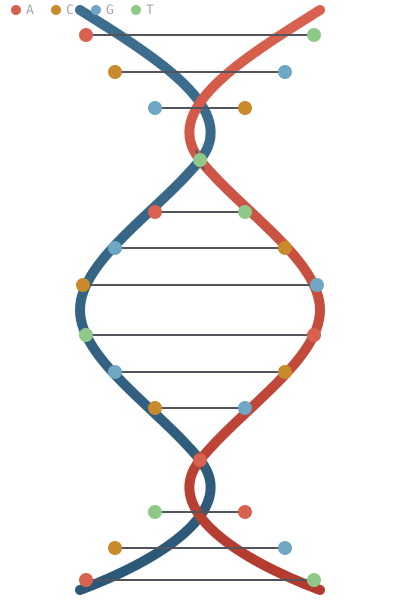

# ModelDB



DNA-inspired data-storage and AI-infrastructure research: a conversational data engine for AI models and databases, an embeddable encrypted key-value store for mobile and wearables, and a DNA-inspired compression engine for ML model weights. Three projects, one underlying idea — encode information the way biological systems do (four-symbol alphabets, content-addressed redundancy, density over raw speed) — applied to three different problems.

**[📖 Live site & documentation →](https://saji1970.github.io/ModelDB/)** · **[🧬 DNA-inspired storage & quantum computing whitepaper →](DNA-STORAGE-WHITEPAPER.md)**

## Projects in this repo

### [MDC — Molecular Data Center](mdc/) · [docs](https://saji1970.github.io/ModelDB/platform.html)

A conversational data engine that stores AI models, images, documents, and ordinary database tables side by side — queried entirely in plain sentences, no SQL required. An LLM proposes an interpretation; a deterministic validator, never the LLM itself, decides what operation actually reaches storage. Tensor-level model access (retrieve one layer without touching the rest of the checkpoint), real tiered storage down to a working DNA-encoding archival tier (binary → A/C/G/T, with a real error-correction and corruption-simulation harness — see the whitepaper above), a REST API open for third-party NLU integration (RASA or custom).

```bash
cd mdc && pip install -r requirements.txt && python -m mdc serve
```

### [mdc-lite](mdc-lite/) · [docs](https://saji1970.github.io/ModelDB/docs.html) · [latest release](https://github.com/saji1970/ModelDB/releases/latest)

The embeddable counterpart, for the places a server can't reach — a watch face, a phone app, a background service. A 345 KB encrypted key-value store in Rust: XChaCha20-Poly1305 for every value *and* every key name, a 5-function C ABI, real cross-platform builds (macOS, Windows, Android — iOS/watchOS build from source, documented why).

### [MemCell](MEMCELL.md) — a DNA-inspired compression engine

A multi-stage lossless compression engine optimized for ML model storage, whose pipeline is explicitly modeled on DNA and cellular information storage — a pattern-genome codebook standing in for DNA's codon table, byte-plane transposition modeled on chromosome sorting, delta encoding modeled on neural adaptation. Self-contained C++17, zero external dependencies, reaching up to 88% reduction on repeated structures. See the [whitepaper](DNA-STORAGE-WHITEPAPER.md#15-memcells-own-bio-inspired-lineage) for how its biological framing maps to its actual pipeline stages.

## License

Apache License 2.0 for MDC and mdc-lite (see each project's own `LICENSE`). See [MEMCELL.md](MEMCELL.md) for MemCell's terms.
